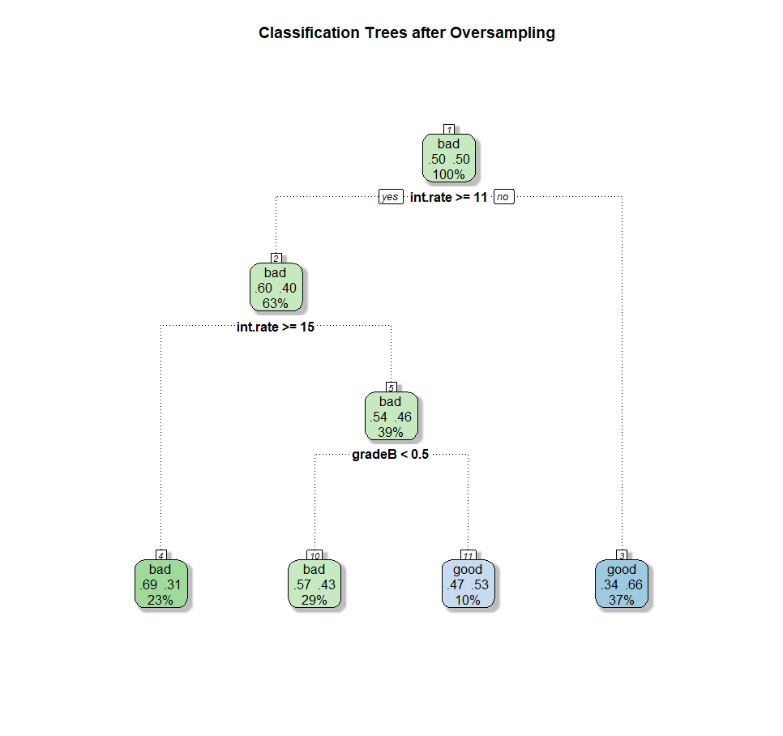
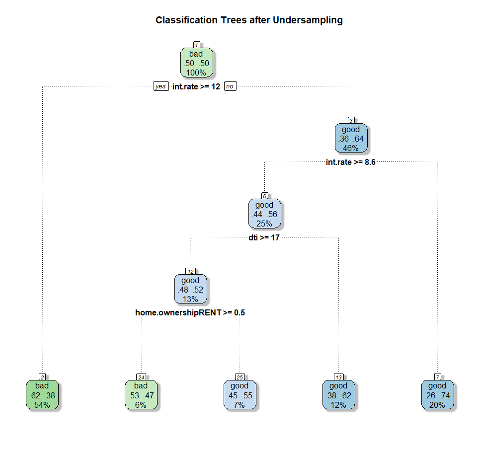
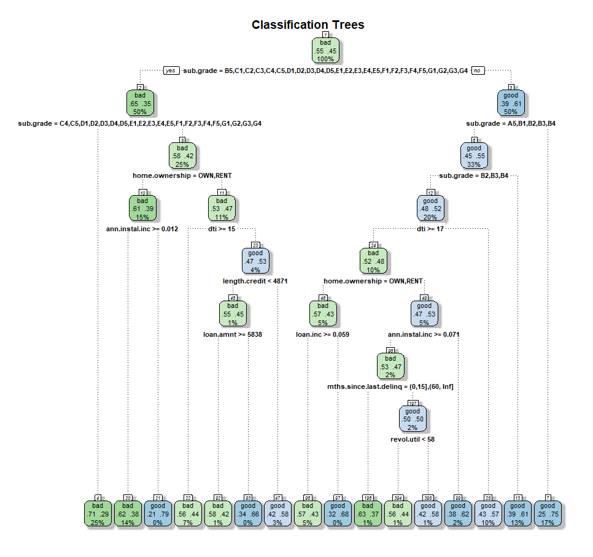
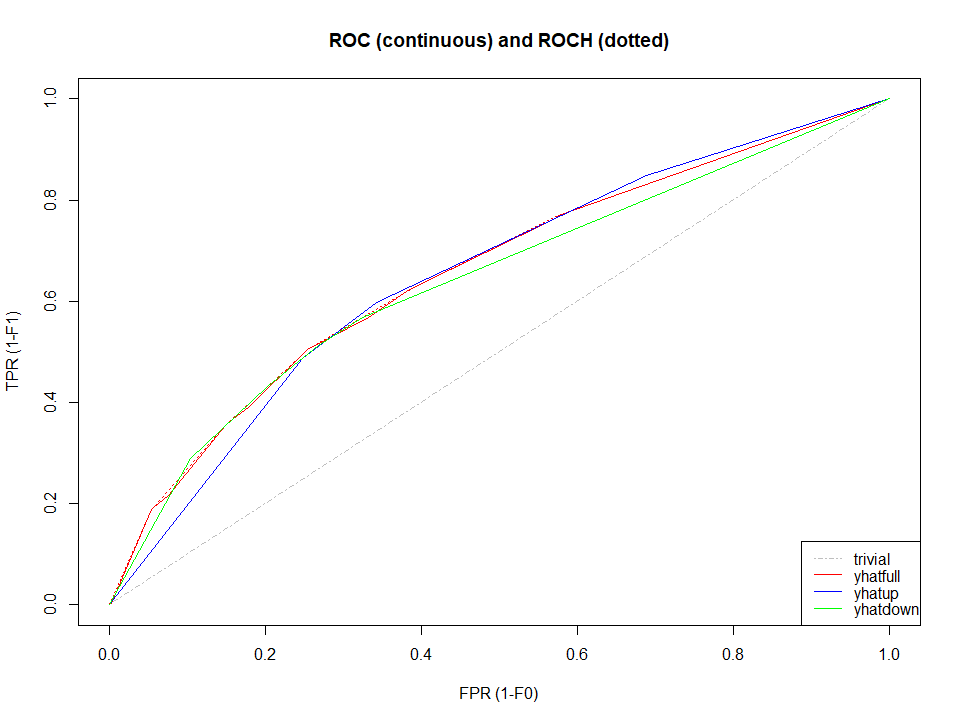

[](http://quantlet.de/index.php?p=info)

## [](http://quantlet.de/) **SPL_CreditRisk_P2P_Classification_Tree** [](http://quantlet.de/d3/ia)

```yaml
Name of QuantLet : SPL_CreditRisk_P2P_Classification_Tree

Published in : Credit Risk Analysis of Peer to Peer Lending Based on the Logistic Regression Model and Classification Trees

Description : 'Finds the optimal classification tree using rpart and caret packages. To combat the class imbalance, 
prior probablities and resampling methods were applied. All classification trees were trained with the training set and evaluated
with the test set. AUC and several threshold metrics were used to evaluate the predictive capablitity.'

Keywords : 'Classification Trees, AUC, ROC, confusion matrix, F-metric, class imbalance, over-sampling. undersampling, 
prior probability'

Author : Ranqing Song

Datafile:
- prep_data.csv : 'extracted data from the files downloaded from Lending Club 2014 and 2015'


Example : 
- classification_tree_oversampling: 'Classification Trees generated based on over-sampled train set.'
- classification_tree_undersampling: 'Classification Trees generated based on under-sampled train set.'
- classification_trees: 'Classification Trees generated based on train set with defined prior probabilities.'


```







### R Code:
```r
# clear variables, close windows and change dictionary
rm(list = ls(all = TRUE))
graphics.off()
# wdir<- '~/Dropbox/7 miao/SPL-WS1819-20181017/p2p_lender' #mac
setwd("C:/Users/srq04/Dropbox/7 miao/SPL-WS1819-20181017/p2p_lender/a_final")  #windows
options(scipen = 200)  ##do not use scientific notation

# install and load packages
libraries = c("caret", "hmeasure", "gmodels", "MASS", "formatR", "plyr", "rattle", "data.table", "LiblineaR", "hmeasure", "rpart", "ROSE", "rpart.plot", "ModelMetrics", "stargazer")
lapply(libraries, function(x) if (!(x %in% installed.packages())) {
    install.packages(x)
})
lapply(libraries, library, quietly = TRUE, character.only = TRUE)

# load data
dataset = read.csv("prep_data.csv")
dataset = dataset[, !(colnames(dataset) %in% c("X"))]
## split-sample
set.seed(1234)
idx.train = createDataPartition(y = dataset$loan.status, p = 0.6, list = FALSE)
## 60% default and non-default sample will be arranged into train set
train = dataset[idx.train, ]
test = dataset[-idx.train, ]
test = test[!(test$home.ownership == "ANY"), ]  #only one in test set

## CARTS with rpart, handle imbalance with prior
prior.candidates = data.frame(prior = seq(0.05, 1, 0.05), AUC = NA)

for (x in 1:nrow(prior.candidates)) {
    dt.train = rpart(loan.status ~ ., data = train, method = "class", parms = list(prior = c(prior.candidates$prior[x], 1 - prior.candidates$prior[x])), control = rpart.control(cp = 0.001))
    yhat.test = as.vector(predict(dt.train, newdata = test, type = "prob")[, 2])
    prior.candidates[x, "AUC"] = ModelMetrics::auc(as.numeric(test$loan.status) - 1, yhat.test)
}

optimal.prior = prior.candidates[which.max(prior.candidates$AUC), ]  ## parms=list(prior=c(0.55,0.45)
# minbucket: the minimal number of observations of each node
param.candidate = expand.grid(cp = seq(0, 0.025, length.out = 10), minbucket = c(0, 5, 10, 20))
for (i in 1:nrow(param.candidate)) {
    dttrain = rpart(loan.status ~ ., data = train, method = "class", parms = list(prior = c(0.55, 0.45)), control = rpart.control(param.candidate$cp[i], minsplit = param.candidate$minbucket[i]))
    yhattrain = as.vector(predict(dttrain, newdata = test, type = "prob")[, 2])
    param.candidate[i, "AUC"] = ModelMetrics::auc(as.numeric(test$loan.status) - 1, yhattrain)
}
optimalparam = param.candidate[which.max(param.candidate$AUC), ]  #the model with highest AUC is not pruned

# check cp with cptable
dtm1 = rpart(loan.status ~ ., data = train, method = "class", parms = list(prior = c(0.55, 0.45)), control = rpart.control(cp = 0.001))
cpmin = dtm1$cptable[which.min(dtm1$cptable[, "xerror"]), "CP"]  #gettinge the smallest xerror cross-validation error, cp=0.001
dtfull= rpart(loan.status ~ ., data = train, method = "class", parms = list(prior = c(0.55, 0.45)), control = rpart.control(cp = cpmin))
fancyRpartPlot(dtfull, main = "Classification Trees", sub = " ")  #plot trees

## caret oversampling and undersampling: handle imbalance
set.seed(222)
var = train[, !(colnames(train) == "loan.status")]  #extract explanatory variables
upSampleTrain = upSample(x = var[, ], y = train$loan.status, yname = "loan.status")  #upsampling
table(upSampleTrain$loan.status)
set.seed(111)
downSampleTrain = downSample(x = var[, ], y = train$loan.status, yname = "loan.status")  #downsampling

myControl = trainControl(method = "repeatedcv", number = 5, repeats = 3, classProbs = T, summaryFunction = twoClassSummary)
dtCaretup = train(loan.status ~ ., upSampleTrain, method = "rpart", trControl = myControl, metric = "ROC")
dtCaretdown = train(loan.status ~ ., downSampleTrain, method = "rpart", trControl = myControl, metric = "ROC")

fancyRpartPlot(dtCaretup$finalModel, main = "Classification Trees after Oversampling", sub = " ")
fancyRpartPlot(dtCaretdown$finalModel, main = "Classification Trees after Undersampling", sub = " ")

##evaluation with train set
print(dtCaretup)
print(dtCaretdown) # downsampling is better for training set

##prediction
y.test = as.numeric(test$loan.status == "good")
yhatdt = predict(dtfull, newdata = test, type = "prob")[, 2] 
yhatup = predict(dtCaretup, newdata = test, type = "prob")[, 2]  #probabilities of good
yhatdown = predict(dtCaretdown, newdata = test, type = "prob")[, 2]
lr.roc = data.frame(yhatfull = yhatdt, yhatup = yhatup, yhatdown = yhatdown)
h2 = HMeasure(true.class = y.test, scores = lr.roc)

# create the vector to compare threshold metrics
aucCompare = h2$metrics[c("AUC", "Sens", "Spec", "Precision", "F", "TP", "FP", "TN", "FN")]
stargazer(aucCompare, summary = F, rownames = F)
#plt ROC
plotROC(h2, which = 1)

```
