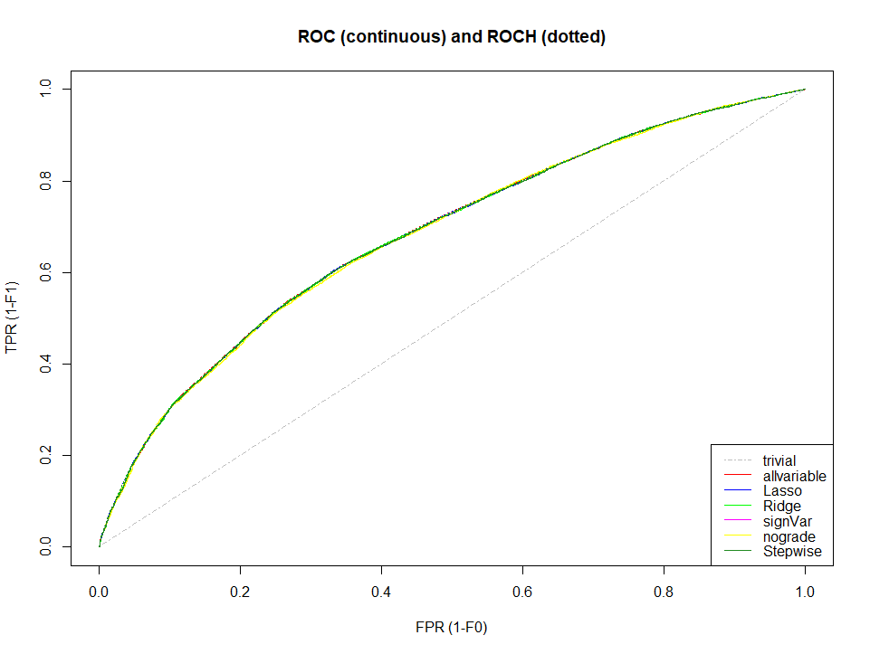
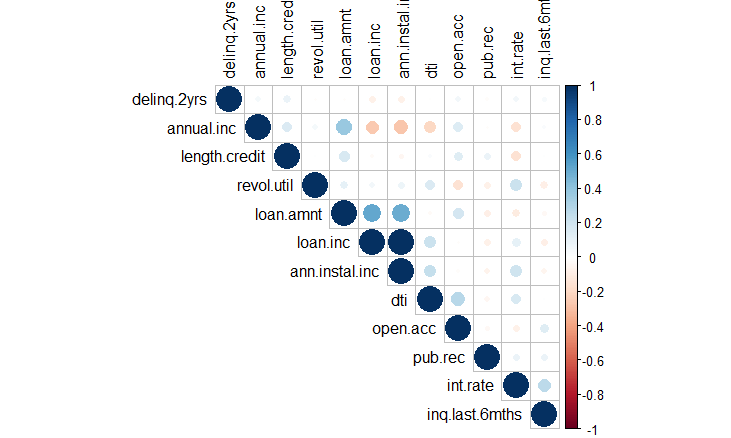

[](http://quantlet.de/index.php?p=info)

## [](http://quantlet.de/) **SPL_CreditRisk_P2P_Classification_Tree** [](http://quantlet.de/d3/ia)

```yaml
Name of QuantLet : SPL_CreditRisk_P2P_Logistic_Regression

Published in : Credit Risk Analysis of Peer to Peer Lending Based on the Logistic Regression Model and Classification Trees

Description : 'Finds the optimal regression models based on prapared dataset. Built regressions based on the train set and evaluated
them with the test set.'

Keywords : 'glm, AUC, ROC, confusion matrix, F-metric, Lasso, Ridge, AIC, stepwise selection'

Author : Ranqing Song

Datafile:
- prep_data.csv : 'extracted data from the files downloaded from Lending Club 2014 and 2015'

Example : 
- corrplot: 'correlation plot of all predictors.'
- ROC_plot: 'ROC plot of all regressions.'
```




### R Code:
```r
# clear variables, close windows and change dictionary
rm(list = ls(all = TRUE))
graphics.off()
# wdir = '~/Dropbox/7 miao/SPL-WS1819-20181017/p2p_lender' #mac
setwd("C:/Users/srq04/Dropbox/7 miao/SPL-WS1819-20181017/p2p_lender/a_final")  #windows
options(scipen = 200)  ##do not use scientific notation

# install and load packages
libraries = c("caret", "hmeasure", "MASS", "zoo", "corrplot", "LiblineaR", "stargazer")
lapply(libraries, function(x) if (!(x %in% installed.packages())) {
    install.packages(x)
})

lapply(libraries, library, quietly = TRUE, character.only = TRUE)

# load data
dataset = read.csv("prep_data.csv")
dataset = dataset[, !(colnames(dataset) %in% c("X"))]
## split-sample
set.seed(1234)
idx.train = createDataPartition(y = dataset$loan.status, p = 0.6, list = FALSE)
## 60% default and non-default sample will be arranged into train set
train = dataset[idx.train, ]
test = dataset[-idx.train, ]
test = test[!(test$home.ownership == "ANY"), ]

# check correlation of variables
vecnum = NULL
num.var = function(x) {
    for (i in 1:ncol(x)) {
        if (class(x[, i]) == "numeric" | class(x[, i]) == "integer") 
            vecnum = c(vecnum, i)
    }
    return(vecnum)
}
num.data = dataset[, num.var(dataset)]
correlat = cor(num.data)
corrplot(correlat, type = "upper", order = "hclust", tl.col = "black")

## penalized models code the regressor with dummy variables and then standardizes the dummy variables The lasso method requires initial standardization of the regressors,
## so that the penalization scheme is fair to all regressors.  For categorical regressors, we code the regressor with dummy variables and then standardizes the dummy
## variables.  It is common to only standardize continuous variables and not standardize dummy variables.  Make sure to get the scaling statistics info only from the
## train dataset so that no information flows from the test data to the training data
X.train = model.matrix(loan.status ~ . - 1, train)
X.test = model.matrix(loan.status ~ . - 1, test)
scalingInformation = preProcess(X.train, method = c("center", "scale"), na.remove = FALSE)
y.train = as.numeric(train$loan.status == "good")
y.test = as.numeric(test$loan.status == "good")
X.train = predict(scalingInformation, newdata = X.train)
X.test = predict(scalingInformation, newdata = X.test)
lrall = glm(loan.status ~ ., data = data.frame(cbind(loan.status = y.train, X.train)), family = binomial(link = "logit"))
lambda = 2
lrlasso = LiblineaR(X.train, y.train, type = 6, cost = 1/lambda, epsilon = 0.0001)  #L1-regularized logistic regression
lrridge = LiblineaR(X.train, y.train, type = 0, cost = 1/lambda, epsilon = 0.0001)  # L2-regularized logistic regression (primal) 
## a model with sign. variables
lrm2 = glm(loan.status ~ . - annual.inc - purpose - revol.util - loan.inc - ann.instal.inc, data = train, family = binomial(link = "logit"))
## a model without grade
lrm3 = glm(loan.status ~ . - grade, data = train, family = binomial(link = "logit"))
## using stepwise, with glm.stepwise the steps of model selection could be seen
lrbasic = glm(loan.status ~ 1, data = data.frame(cbind(loan.status = y.train, X.train)), family = binomial(link = "logit"))
lrStepwise = stepAIC(lrbasic, scope = list(lower = lrbasic, upper = lrall), direction = "forward", trace = TRUE, steps = 100)

# Compare coefficients of standard and regularized logit models
comCoef = cbind(allvariable = round(coef(lrall), 2)[2:74], lasso = -1 * round(lrlasso$W, 2)[1:73], 
                    ridge = -1 * round(lrridge$W, 2)[1:73], step = round(coef(lrStepwise), 2)[2:74])

# outputs of regressions
stargazer(lrall, lrm2, lrm3, lrStepwise, title = "Results of regressions", align = T, dep.var.labels = c("All", "Sign", "Nog", "Step"), 
          no.space = T, column.sep.width = "-15pt")

# Now make predictions and evaluate the performance.
yhatFull = predict(lrall, newdata = data.frame(X.test), type = "response")
yhatLasso = predict(lrlasso, X.test, proba = TRUE, decisionValues = FALSE)
yhatRidge = predict(lrridge, X.test, proba = TRUE, decisionValues = FALSE)
yhatLrm2 = predict(lrm2, newdata = test, type = "response")
yhatLrm3 = predict(lrm3, newdata = test, type = "response")
yhatLrAIC = predict(lrStepwise, newdata = data.frame(X.test), type = "response")

# confusion matrix with different cutoff
tau = 0.4
yhat.full.class = ifelse(yhatFull > tau, 1, 0)
cmf = confusionMatrix(yhat.full.class, y.test)

# make sure to extract the right values for evaluation
lr.roc = data.frame(allvariable = yhatFull, Lasso = yhatLasso$probabilities[, 1], Ridge = yhatRidge$probabilities[, 1], 
                    signVar = yhatLrm2, nograde = yhatLrm2, Stepwise = yhatLrAIC)
h = HMeasure(true.class = y.test, scores = lr.roc)

# create the vector to compare threshold metrics
aucCompare = h$metrics[c("AUC", "Sens", "Spec", "Precision", "F", "TP", "FP", "TN", "FN")]
stargazer(aucCompare, summary = F, rownames = F)

#plt ROC
plotROC(h, which = 1)

```
