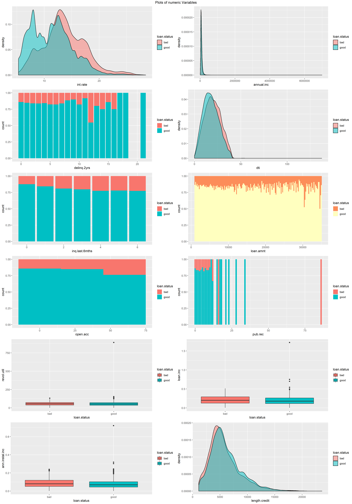
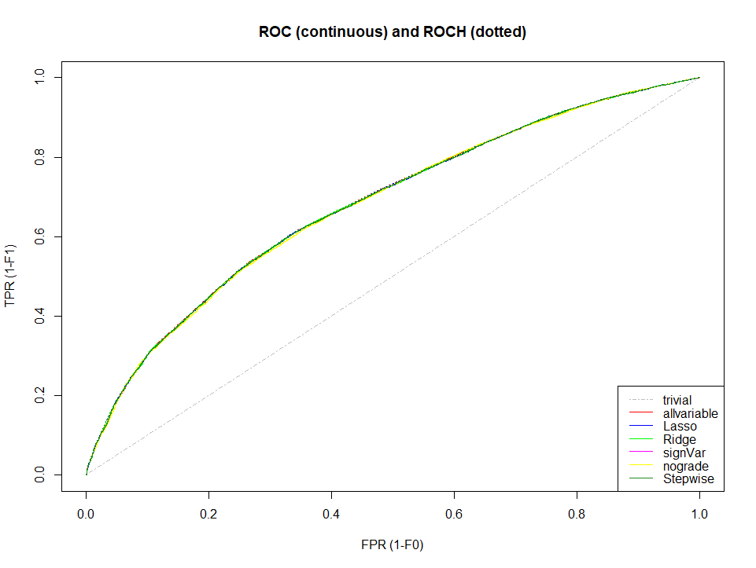

##  **[SPL_CreditRisk_P2P_Data_Prepration](SPL_CreditRisk_P2P_Data_Prepration)**

##  **[SPL_CreditRisk_P2P_Logistic_Regression](SPL_CreditRisk_P2P_Logistic_Regression)**

##  **[SPL_CreditRisk_P2P_Classification_Tree](SPL_CreditRisk_P2P_Classification_Tree)**

### Abstract of the work:
P2P lending is growing mode that intermediates lenders and borrowers directly. In this paper, the data collected by Lending Club, one of the
largest P2P lending platform, would be used build credit risk predition models. The employed data was prepared through resampling and 
varibles were converted. Logistic regressions and classification trees are basic algorithms for binary classification topic. 
After modelling, the predictive capability of these models were evaluated with threshold metrics.
AUC or ROC is the most important evaluation metric.

### Here you see some plots from this repository:

