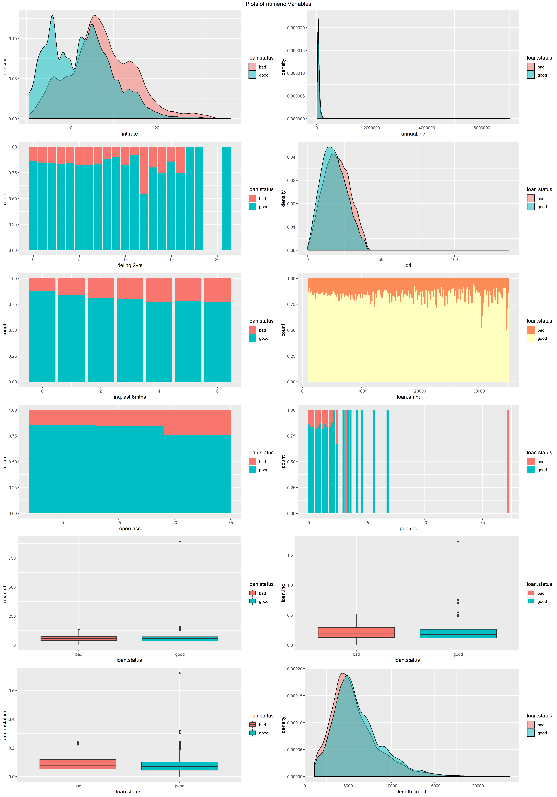

[](http://quantlet.de/index.php?p=info)

## [](http://quantlet.de/) **SPL_CreditRisk_P2P_Classification_Tree** [](http://quantlet.de/d3/ia)

```yaml
Name of QuantLet : SPL_CreditRisk_P2P_Classification_Tree

Published in : Credit Risk Analysis of Peer to Peer Lending Based on the Logistic Regression Model and Classification Trees

Description : 'Prepared the data for modeling and predicting. Raw data could be downloaded from URL. 
Descriptive data analysis ís done'

Keywords : 'plot, variables, descriptive variables, ggplot'

Author : Ranqing Song

Example : 
- plot_cat_variables: 'plots of distributions of all categorical variales.'
- plot_num_variables: 'plots of distributions of all numeric variables.'
```



### R Code:
```r
# clear variables, close windows and change dictionary
rm(list = ls(all = TRUE))
graphics.off()
#wdir<- "~/Dropbox/7 miao/SPL-WS1819-20181017/p2p_lender"   #mac
setwd("C:/Users/srq04/Dropbox/7 miao/SPL-WS1819-20181017/p2p_lender/a_final") #windows
options(scipen = 200) ##do not use scientific notation

#install and load packages
libraries = c("readr","caret","downloader","lubridate", "dplyr","gridExtra")
lapply(libraries, function(x) if (!(x %in% installed.packages())) {
  install.packages(x)
})
lapply(libraries, library, quietly = TRUE, character.only = TRUE)

##load data
download("https://resources.lendingclub.com/LoanStats3c.csv.zip", dest="data_2014.zip")
download("https://resources.lendingclub.com/LoanStats3d.csv.zip", dest="data_2015.zip")
data2014   = read_csv("data_2014.zip", skip=1)
data2015   = read_csv("data_2015.zip", skip=1)
datasetall = rbind(data2014, data2015)  

##replace "_" in column names with "."
names(datasetall) = gsub("_", ".", names(datasetall))  

#check the propoortion of bad and good borrowers in terms of loan term
prop.table(xtabs(~term+loan.status, data=datasetall),1) 

##keep loans with status: "Charged Off", "Default", "Fully Paid"
datasetall   = subset(datasetall, loan.status %in% c("Charged Off", "Default", "Fully Paid"))
prop.table(xtabs(~term+loan.status, data=datasetall),1) 
dataset36mon = subset(datasetall, term == "36 months")

#selecting independent variables
datasetvar = subset(dataset36mon, select = c("int.rate","grade","sub.grade","home.ownership","annual.inc","delinq.2yrs","dti",
                                              "inq.last.6mths","installment","loan.status","loan.amnt","mths.since.last.delinq","open.acc",
                                              "pub.rec","purpose","revol.util","earliest.cr.line","issue.d"))
set.seed(123)
idxtrain = createDataPartition(datasetvar$loan.status, p=0.2, list=FALSE)
##60% default and non-default sample will be arranged into train set
newdata = datasetvar[idxtrain, ]  

##convert the dependent variable into binary: Loans charged off or default are defined as bad, others are defined as good
levels(dataset$loan.status) = c("bad","good") 
#distribution of default and non-default sample
summary(dataset$loan.status) 
table(dataset$loan.status) / nrow(dataset)  

##for numeric Variable: int.rate and revol,util, get rid of %, and convert into numeric variables
chartonum = c("int.rate", "revol.util")
for (i in chartonum ) {
  dataset[, i] = gsub("%", " ", dataset[, i])
}  
dataset[, chartonum] = lapply(dataset[, chartonum], as.numeric)

#convert into date format
for (i in c("earliest.cr.line", "issue.d")) {
  dataset[, i] = as.Date(paste("01-", dataset[, i], sep = ""), format = "%d-%b-%Y")
}
#creating new variable, since two borrower indebtedness variables are not directly given
# creating loan amount to annual income
dataset$loan.inc       = dataset$loan.amnt / dataset$annual.inc
#creating annual instalment to income, the variable instalment is monthly
dataset$ann.instal.inc = dataset$installment * 12 / dataset$annual.inc
#the variable credit length
dataset$length.credit  = difftime(dataset$issue.d, dataset$earliest.cr.line, units = "auto")
dataset$length.credit  = as.numeric(dataset$length.credit)

##drop useless variables
useddata = dataset[, !(colnames(dataset) %in% c("installment", "earliest.cr.line", "issue.d", "X"))]
######check missing values
summary(useddata)
#months since last delinquency #has aroub half observations sind without value
#replace NA with negative value, than convert the numeric variable into categories
useddata$mths.since.last.delinq =  ifelse(is.na(useddata$mths.since.last.delinq), -100, useddata$mths.since.last.delinq)
useddata$mths.since.last.delinq = cut(useddata$mths.since.last.delinq, breaks = c(-Inf, seq(0, 60, 15), Inf)) #since 1st Qu=15, median=30
useddata$mths.since.last.delinq = as.factor(useddata$mths.since.last.delinq)
useddata$revol.util[is.na(useddata$revol.util)] = 53.02 #replce NAs with mean value

##visualization of numeric variadles
plotIntRate = ggplot(useddata, aes(int.rate, fill = loan.status))   + geom_density(alpha=.5)
plotAnnInc  = ggplot(useddata, aes(annual.inc, fill = loan.status)) + geom_density(alpha=.5)
plotDelinq  = ggplot(useddata, aes(delinq.2yrs)) + geom_bar(aes(fill = loan.status), position = "fill")
plotDti     = ggplot(useddata, aes(dti, fill = loan.status)) + geom_density(alpha=.5)
plotInq     = ggplot(useddata, aes(inq.last.6mths)) + geom_bar(aes(fill = loan.status), position = "fill")
plotAmt     = ggplot(useddata, aes(loan.amnt)) + geom_histogram(aes(fill = loan.status), position = "fill", binwidth = 200) + scale_fill_brewer(palette = "Spectral")
plotOpenacc = ggplot(useddata, aes(open.acc))  + geom_histogram(aes(fill = loan.status), position = "fill", binwidth = 30)
plotPudrec  = ggplot(useddata, aes(pub.rec))   + geom_bar(aes(fill = loan.status), position = "fill")
plotRevol   = ggplot(useddata, aes(x = loan.status, y = revol.util, fill = loan.status)) + geom_boxplot() 
plotLoaninc = ggplot(useddata, aes(x = loan.status, y = loan.inc, fill = loan.status))   + geom_boxplot() 
plotInsinc  = ggplot(useddata, aes(x = loan.status, y = ann.instal.inc, fill = loan.status)) + geom_boxplot() 
plotCred    = ggplot(useddata, aes(length.credit, fill = loan.status)) + geom_density(alpha=.5)

plotNum     = grid.arrange(plotIntRate, plotAnnInc, plotDelinq, plotDti, plotInq, plotAmt, plotOpenacc, plotPudrec, plotRevol, plotLoaninc, plotInsinc, plotCred, 
                       nrow= 6, top = "Plots of numeric Variables")
ggsave("plot_num_variables.png", plotNum, width = 420, height = 600, units = "mm")

##visualization of category variables
plotStatus   = ggplot(useddata, aes(loan.status)) + geom_bar(stat = "count") 
plotGrade    = ggplot(useddata, aes(grade))       + geom_bar(aes(fill = loan.status), position = "fill") + scale_fill_brewer(palette = "Spectral")
plotSubgrade = ggplot(useddata, aes(sub.grade))   + geom_bar(aes(fill = loan.status), position = "fill") + scale_fill_brewer(palette = "Spectral")
plotHome     = ggplot(useddata, aes(home.ownership)) + geom_bar(aes(fill = loan.status), position = "fill") + scale_fill_brewer(palette = "RdGy")
plotPurpose  = ggplot(useddata, aes(purpose))     + geom_bar(aes(fill = loan.status), position = "fill") + scale_fill_brewer(palette = "Dark2")
plotMthdel   = ggplot(useddata, aes(mths.since.last.delinq)) + geom_bar(aes(fill = loan.status), position = "fill") + scale_fill_brewer(palette = "Dark2")
plotCat      = grid.arrange(plotStatus, plotGrade, plotSubgrade, plotHome, plotPurpose, plotMthdel, nrow=3, top = "Plots of catogorical Variables")
ggsave("plot_cat_variables.png", plotCat, width = 800, height = 800, units = "mm")

#save prepared data
write.csv(useddata, file = "prep_data.csv")
```
